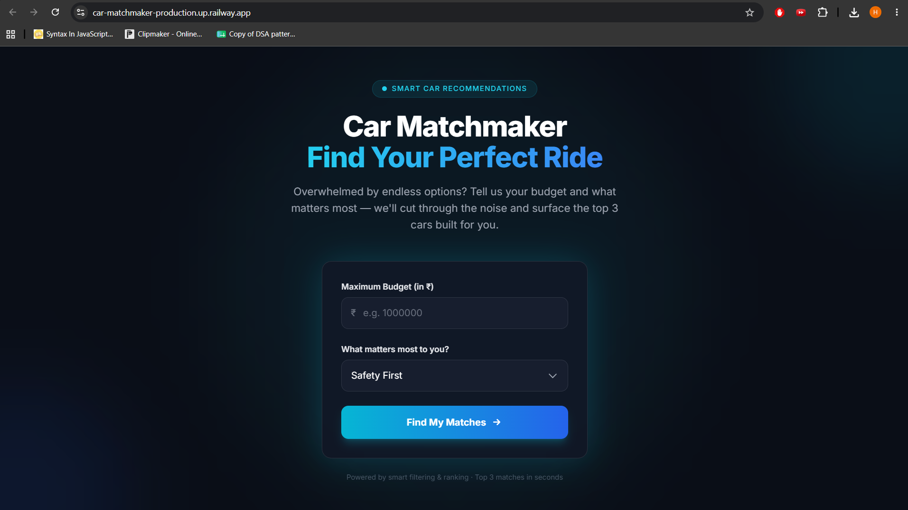
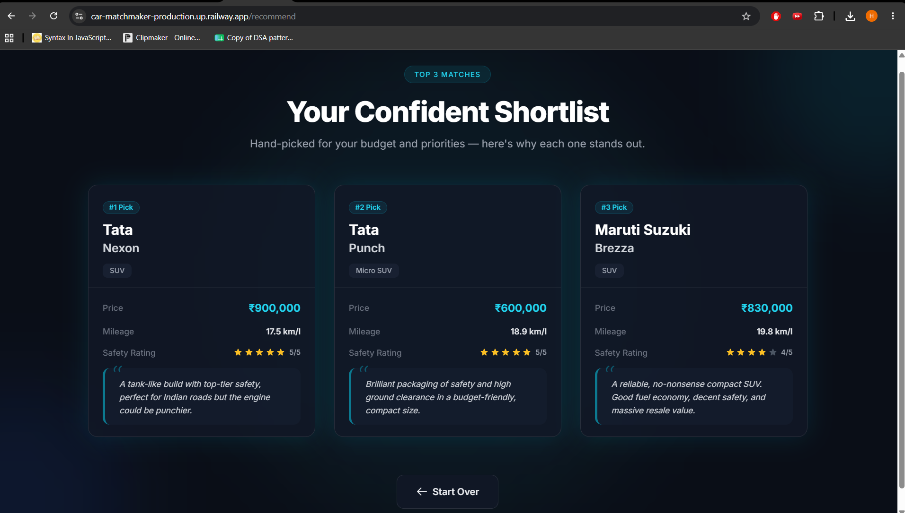

# Car Matchmaker

**CarDekho Group — Take-Home Assignment (Software Engineer)**

A full-stack web app that helps car buyers narrow a large catalog down to a **top 3 shortlist** — by entering a budget and whether safety or fuel efficiency matters more.

**Live app:** [https://car-matchmaker-production.up.railway.app/](https://car-matchmaker-production.up.railway.app/)

**Repository:** [https://github.com/Harshita9v9/car-matchmaker](https://github.com/Harshita9v9/car-matchmaker)

| Deliverable | Link |
|-------------|------|
| Live URL | [car-matchmaker-production.up.railway.app](https://car-matchmaker-production.up.railway.app/) |
| GitHub repo | [Harshita9v9/car-matchmaker](https://github.com/Harshita9v9/car-matchmaker) |
| Run locally | `docker compose up --build` (see below) |
| Screen recording | [https://youtu.be/4mn6sJqibM4](https://youtu.be/4mn6sJqibM4) |

---

## Screenshots

### Home page



### Recommendations



---

## Quick start (Docker)

**Prerequisites:** [Docker Desktop](https://www.docker.com/products/docker-desktop/)

```bash
docker compose up --build
```

Open **http://localhost:8080**

```bash
docker compose up --build -d   # background
docker compose down            # stop
```

---

## Local development (optional)

Requires **JDK 17+**.

```cmd
run.cmd
```

or

```bash
mvnw spring-boot:run
```

---

## Architecture

```
Browser
   │
Thymeleaf UI  (index.html, results.html)
   │
Spring MVC Controller  (CarController)
   │
Recommendation Service  (CarService — filter, sort, top 3)
   │
In-Memory Dataset  (15 cars loaded at startup)
```

**Request flow:** User submits budget + priority → controller calls `getRecommendations()` → service filters by price, sorts by safety or mileage, returns three cars → Thymeleaf renders result cards.

---

## How it works

1. Enter **maximum budget (₹)** and priority: **Safety First** or **Fuel Efficiency**.
2. Backend keeps cars within budget, sorts by `safetyRating` or `mileage` (descending), returns **top 3**.
3. Results show make/model, price, mileage, safety (out of 5), category, and a review snippet.

Dataset: 15 Indian-market cars loaded in memory at startup.

---

## Assignment README (required answers)

### 1. What did you build and why? What did you deliberately cut?

**Built:** A **Car Matchmaker** wizard for the assignment brief — buyers face too many options and need a fast way to shortlist. The app **keeps the decision simple** by asking only for **budget** and **one priority**, then shows **three cars** with specs and short reviews. One session: many choices → three names worth researching further.

**Deliberately cut:**

- **Database (MySQL / PostgreSQL)** — I intentionally avoided introducing a database because the assignment was **time-boxed** and the recommendation logic did **not require persistence**. Keeping the dataset **in memory** reduced setup complexity while still allowing the backend to perform meaningful **filtering, ranking, and recommendation** logic (`@PostConstruct` load of 15 cars).
- **User authentication** — no sign-up; anonymous one-shot flow.
- **Variant-level catalog, compare UI, admin panel, full test suite** — out of scope for a 2–3 hour build; would spread effort away from the core flow.

I focused on a small feature set that works end-to-end rather than a larger app that would stay half-finished.

### 2. What's your tech stack and why did you pick it?

| Layer | Choice |
|--------|--------|
| Language | Java 17 |
| Framework | Spring Boot 3 (Web + Thymeleaf) |
| UI | Thymeleaf + Tailwind CSS (CDN) |
| Build | Maven (`mvnw`) |
| Deploy | Docker + [Railway](https://railway.app) |

**Why:** Java and Spring Boot are a good fit for server-side filtering and sorting with clear structure (controller / service / model). **Thymeleaf** keeps the UI in the same project as the backend — no separate frontend app or REST layer for a simple form → results page. **Tailwind via CDN** adds layout and styling without a Node build step. **Docker Compose** gives reviewers a one-command local run; **Railway** hosts the live demo from the same `Dockerfile`.

### 3. What did you delegate to AI tools vs. do manually? Where did they help most / get in the way?

I used **Cursor** to generate the initial Spring Boot project structure (`Car`, `CarService`, `CarController`), Thymeleaf templates with Tailwind styling, Docker/`compose.yaml` setup, and a first draft of this README.

I **manually** reviewed the generated code, adjusted the recommendation logic, verified sorting behavior (safety vs. mileage), fixed environment issues (Java path, Git credentials, Railway `PORT` binding), deployed to Railway, and tested the application end-to-end in the browser.

**Where AI helped most:** Speed on boilerplate — MVC wiring, HTML templates, multi-stage Dockerfile, and README structure — so more time stayed on behavior and deployment.

**Where AI got in the way:** Occasional over-wordy README phrasing (edited down), and Git push failed until the correct GitHub account was used — that part had to be fixed outside the tool.

The screen recording shows prompting, reviewing output, and correcting issues rather than accepting everything as-is.

### 4. If you had another 4 hours, what would you add?

1. **LLM integration** — short, personalized “why this car fits you” text from budget + priority, not only static reviews.
2. **Cloud database** — PostgreSQL (or similar) for real inventory and updates without redeploying.
3. **Integration tests** for `getRecommendations` (budget filter, sort order, limit of 3).
4. **Health endpoint** for Railway/Docker health checks.

---

## Project structure

```
src/main/java/com/harshita/carmatchmaker/
├── CarMatchmakerApplication.java
├── controller/CarController.java
├── model/Car.java
└── service/CarService.java

src/main/resources/templates/
├── index.html
└── results.html

docs/
├── home.png
└── results.png

Dockerfile
compose.yaml
```

---

## Assignment constraints (checklist)

| Requirement | Met by |
|-------------|--------|
| Working web app | [Live on Railway](https://car-matchmaker-production.up.railway.app/) + Docker locally |
| Run in under 2 min | `docker compose up --build` |
| Full-stack | Thymeleaf UI + Spring recommendation service |
| Screen recording | [https://youtu.be/4mn6sJqibM4](https://youtu.be/4mn6sJqibM4) |
| README (4 questions) | Sections above |

---

## Submission checklist

- [x] [Screen recording](https://youtu.be/4mn6sJqibM4)
- [x] GitHub repo
- [x] Live URL
- [x] README (four questions answered)
- [x] Screenshots in `docs/` 
